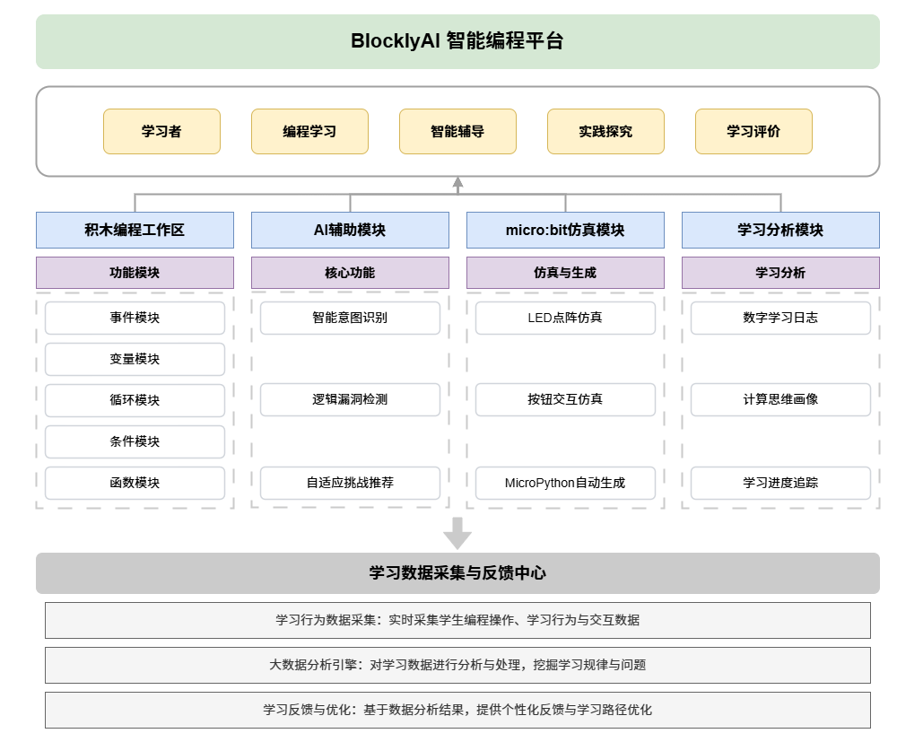
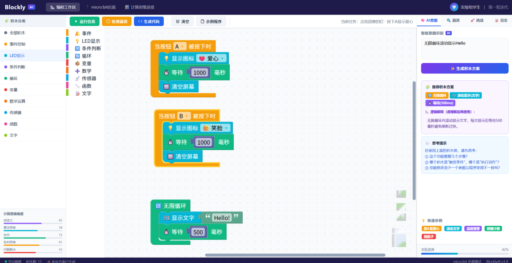
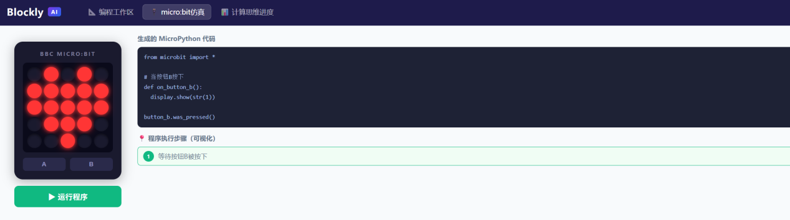

# BlocklyAI 平台介绍

BlocklyAI 是一个面向编程初学者的可视化编程教育平台，基于 Blockly 框架开发，结合 micro:bit 教学需求，提供积木拖拽、智能意图识别、逻辑漏洞检测、自适应挑战推荐和在线仿真等核心功能，旨在降低编程入门门槛，提升学生计算思维与问题解决能力。

---

## 平台整体架构

*图1 BlocklyAI平台整体架构图*

---

## 平台界面概览

*图2 BlocklyAI平台截图*

平台以 Blockly 为底层开发框架，设计了积木编程工作区，支持拖拽式积木编程。结合 micro:bit 教学需求，设计了事件控制、LED显示、输入输出、变量、条件判断、循环结构及函数封装等核心积木模块。学生通过可视化方式完成程序逻辑构建，无需关注语法拼写与格式缩进等细节问题，从而将更多认知资源投入到问题分析、算法设计和程序调试过程中。同时，系统支持积木结构与 MicroPython 代码的实时映射展示，使学生能够观察图形化表示与文本代码之间的对应关系，为后续向文本编程迁移提供认知基础。

---

## 积木编程工作区

*图3 积木编程工作区*

---

## 智能意图识别模块

为降低初学者从问题需求到程序实现之间的转换难度，平台引入智能意图识别模块。学生可以通过自然语言描述程序功能需求（如图3.4所示）。系统利用自然语言处理技术分析用户意图，并自动生成对应的积木搭建方案。与传统自动生成代码工具不同，BlocklyAI 在输出结果的同时会生成逻辑解释卡片，说明各积木的功能作用及执行流程。当系统生成积木方案时，学生必须阅读解释内容并自主完成积木搭建后才能进入仿真运行阶段，以避免对 AI 产生机械依赖。该设计体现了建构主义中的学习支架理论，引导学生参与程序逻辑建构过程。

*图4 智能意图识别功能*

---

## 逻辑漏洞检测模块

针对初学者在程序设计过程中常见的逻辑错误，平台设计了逻辑漏洞检测模块。系统在程序运行前自动执行静态分析，对积木结构进行扫描并识别潜在问题，包括：

- 无限循环风险
- 未初始化变量
- 未被调用的变量或函数
- 条件判断缺失
- 传感器输入范围异常
- 显示切换未清屏

检测结果通过高亮标注方式直接定位到对应积木，并以自然语言形式给出修改建议（如图3.5所示）。相较于传统编译器晦涩的错误提示，该模块将问题诊断前移至编程阶段，帮助学生及时发现和修正错误，降低调试认知负荷，促进学生代码调试能力的发展。

*图5 逻辑漏洞检测*

---

## 自适应挑战推荐机制

为满足不同能力水平学生的发展需求，平台构建了自适应挑战推荐机制。系统依据学生当前程序复杂度、积木使用种类、错误记录及学习历史，动态生成符合其最近发展区的拓展任务（如图3.6所示）。

*图6 自适应挑战推荐*

---

## micro:bit 在线仿真模块

平台内置 micro:bit 在线仿真器，可模拟 5×5 LED 点阵、按钮输入及部分传感器功能。学生无需频繁下载程序即可即时观察运行效果，提高调试效率。同时，系统支持程序执行过程的可视化展示，通过高亮当前执行积木帮助学生建立程序运行的心理模型（如图3.7所示）。

*图7 micro:bit仿真模块*

---

## 总结

BlocklyAI 平台通过积木编程、智能辅助、静态检查、自适应推荐和即时仿真等功能的有机结合，构建了一个低门槛、高反馈、个性化且注重思维培养的编程学习环境，为 K-12 编程教育提供了有力支撑。
